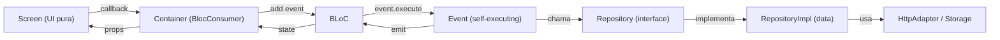

# Definição de Arquitetura Flutter

> Documento de referência de arquitetura para projetos Flutter.

---

## Stack Tecnológica

| Pacote                  | Finalidade                                |
|-------------------------|-------------------------------------------|
| `flutter_bloc`          | Gerenciamento de estado (BLoC pattern)    |
| `get_it`                | Injeção de dependência (Service Locator)  |
| `go_router`             | Navegação declarativa                     |
| `equatable`             | Comparação de objetos (Entities & States) |
| `http`                  | Cliente HTTP                              |
| `flutter_secure_storage`| Persistência segura local                 |

**Dev dependencies:**

| Pacote          | Finalidade          |
|-----------------|---------------------|
| `bloc_test`     | Testes de BLoC      |
| `mocktail`      | Mocks               |
| `faker`         | Geração de dados    |
| `flutter_lints` | Lint rules           |

---

## Estrutura de Pastas

```
lib/
├── main.dart
│
├── core/
│   ├── dependency_injection.dart      # Instância global do GetIt
│   ├── core_service_locator.dart      # Registro de dependências globais
│   ├── routes.dart                    # Constantes de rotas
│   ├── infra/
│   │   └── http_adapter.dart          # Abstração do cliente HTTP
│   ├── theme/
│   │   └── color_scheme.dart          # Design system / cores
│   └── utils/
│       └── dimension_utils.dart       # Utilitários compartilhados
│
└── features/
    └── <feature_name>/
        ├── <feature_name>_navigator.dart         # GoRoute da feature
        ├── <feature_name>_service_locator.dart    # DI da feature
        │
        ├── domain/
        │   ├── entities/
        │   │   └── <entity>.dart                  # Entidades com Equatable
        │   ├── errors/
        │   │   └── domain_errors.dart             # Enum de erros de domínio
        │   └── repositories/
        │       └── <feature>_repository.dart      # Interface abstrata
        │
        ├── data/
        │   ├── models/                            # DTOs / Data models
        │   └── repositories/
        │       └── <feature>_repository_impl.dart # Implementação concreta
        │
        ├── presentation/
        │   ├── <feature>_bloc.dart                # BLoC + BlocProvider
        │   ├── <feature>_bloc_event.dart          # Sealed class + parts
        │   ├── <feature>_bloc_state.dart          # State com copyWith
        │   └── events/
        │       ├── event_one.dart                 # part of bloc_event
        │       ├── event_two.dart
        │       └── ...
        │
        └── ui/
            ├── <feature>_container.dart           # BlocConsumer (ponte)
            ├── l10n/
            │   ├── <feature>_l10n.dart            # Fábrica de strings
            │   └── strings/
            │       ├── <feature>_strings.dart     # Interface abstrata
            │       ├── <feature>_en.dart           # Inglês
            │       └── <feature>_pt_br.dart        # Português BR
            └── screens/
                ├── <feature>_screen.dart          # Widget puro (stateless)
                └── widgets/
                    ├── widget_a.dart
                    └── widget_b.dart
```

### Espelhamento nos Testes

```
test/
├── core/
│   └── ...
└── features/
    └── <feature_name>/
        ├── data/                # Testes de repository impl
        ├── presentation/        # Testes de bloc/events
        └── ui/                  # Testes de widgets
```

---

## Camadas e Responsabilidades

### 1. `domain/` — Regras de Negócio (Pura)

Camada **sem dependência de framework**. Contém apenas Dart puro.

- **`entities/`** — Objetos de valor imutáveis com `Equatable`.
- **`errors/`** — Enums de erros de domínio. Erros de infra (HTTP) são mapeados para erros de domínio na camada `data`.
- **`repositories/`** — Interfaces abstratas (`abstract class`). Define o contrato sem saber da implementação.

```dart
// domain/entities/shortened_url.dart
class ShortenedUrl extends Equatable {
  const ShortenedUrl({
    required this.id,
    required this.shortenedUrl,
    required this.originalUrl,
    required this.date,
  });

  final String id;
  final String shortenedUrl;
  final String originalUrl;
  final DateTime date;

  @override
  List<Object?> get props => [id, shortenedUrl, originalUrl, date];
}
```

```dart
// domain/errors/domain_errors.dart
enum DomainError { timeOut, unknownError }
```

```dart
// domain/repositories/url_shortener_repository.dart
abstract class UrlShortenerRepository {
  Future<ShortenedUrl> shortenUrl(String url);
  Future<List<ShortenedUrl>> getShortenedUrls();
  Future<void> deleteAllShortenedUrls();
  Future<void> saveShortenedUrl(ShortenedUrl shortenedUrl);
}
```

---

### 2. `data/` — Implementação de Acesso a Dados

Depende de `domain/` e de `core/infra`. Responsável por:

- Implementar os repositórios com chamadas HTTP, storage, etc.
- Mapear erros de infra para erros de domínio.
- Converter JSON para entidades de domínio (e vice-versa).

```dart
// data/repositories/url_shortener_repository_impl.dart
class UrlShortenerRepositoryImpl extends UrlShortenerRepository {
  UrlShortenerRepositoryImpl({
    required this.httpAdapter,
    required this.storage,
  });

  final HttpAdapter httpAdapter;
  final FlutterSecureStorage storage;

  @override
  Future<ShortenedUrl> shortenUrl(String url) async {
    try {
      final response = await httpAdapter.request(
        url: 'https://api.example.com/shorten',
        method: HttpMethod.post,
        body: {'url': url},
      );
      return ShortenedUrl(/* ... map response ... */);
    } on HttpError catch (e) {
      switch (e) {
        case HttpError.timeOut:
          throw DomainError.timeOut;
        default:
          throw DomainError.unknownError;
      }
    }
  }
}
```

> [!IMPORTANT]
> A camada `data` é o **único lugar** onde erros de infraestrutura são convertidos em erros de domínio.

---

### 3. `presentation/` — Gerenciamento de Estado (BLoC)

Camada responsável por orquestrar ações e gerenciar estado. Composta por 3 arquivos + pasta `events/`.

#### 3.1 — BLoC (`<feature>_bloc.dart`)

O BLoC é **mínimo**. Ele:

1. Recebe o repositório via construtor.
2. Registra um **único handler genérico** que delega a execução ao próprio evento.
3. Contém também a classe `BlocProvider` tipada (facilita o acesso sem boilerplate).

```dart
class UrlShortenerBloc
    extends Bloc<UrlShortenerBlocEvent, UrlShortenerBlocState> {
  UrlShortenerBloc({required this.urlShortenerRepository})
    : super(const UrlShortenerBlocState()) {
    on<UrlShortenerBlocEvent>((event, emit) => event.execute(this, emit));
  }
  final UrlShortenerRepository urlShortenerRepository;
}

class UrlShortenerBlocProvider extends BlocProvider<UrlShortenerBloc> {
  UrlShortenerBlocProvider({super.key, super.child})
    : super(
        create: (context) => UrlShortenerBloc(
          urlShortenerRepository: di<UrlShortenerRepository>(),
        )..add(const LoadShortenedUrls()),
      );

  static UrlShortenerBloc of(BuildContext context) =>
      BlocProvider.of(context);
}
```

> [!TIP]
> O `BlocProvider` customizado centraliza a criação do bloc com suas dependências e dispara eventos iniciais (ex: `LoadShortenedUrls`). Também expõe um método `of()` estático para acesso simplificado.

#### 3.2 — Events (`<feature>_bloc_event.dart` + `events/`)

Os eventos usam:

- **`sealed class`** como classe base para exaustividade no pattern matching.
- **`part` / `part of`** para separar cada evento em seu próprio arquivo mantendo a tipagem no mesmo escopo.
- **Self-executing pattern** — cada evento implementa seu próprio `execute()`, movendo a lógica para fora do BLoC.

```dart
// <feature>_bloc_event.dart
@immutable
sealed class UrlShortenerBlocEvent {
  const UrlShortenerBlocEvent();

  Future<void> execute(
    UrlShortenerBloc bloc,
    Emitter<UrlShortenerBlocState> emit,
  );
}
```

```dart
// events/shorten_url.dart
part of '../url_shortener_bloc_event.dart';

class ShortenUrl extends UrlShortenerBlocEvent {
  const ShortenUrl({required this.url});
  final String url;

  @override
  Future<void> execute(
    UrlShortenerBloc bloc,
    Emitter<UrlShortenerBlocState> emit,
  ) async {
    emit(bloc.state.copyWith(isButtonLoading: true));
    try {
      final shortenedUrl =
          await bloc.urlShortenerRepository.shortenUrl(url);
      emit(bloc.state.copyWith(
        shortenedUrls: [shortenedUrl, ...bloc.state.shortenedUrls],
        isButtonLoading: false,
        shouldClearInput: true,
      ));
      bloc.add(SaveShortenedUrl(shortenedUrl: shortenedUrl));
    } on DomainError catch (e) {
      emit(bloc.state.copyWith(
        isButtonLoading: false,
        error: () => e,
      ));
    }
  }
}
```

> [!NOTE]
> **Por que self-executing events?**
> - O BLoC fica limpo — sem `switch/case` gigante.
> - Cada event é um arquivo isolado, fácil de localizar e testar.
> - A lógica fica coesa: o evento sabe como se executar.

#### 3.3 — State (`<feature>_bloc_state.dart`)

- Usa `Equatable` para comparação eficiente.
- Todos os campos são `final` (imutável).
- Método `copyWith` para emissão de novos estados.
- Campos nullable (como `error`) usam `Function()?` no `copyWith` para permitir setar explicitamente como `null`.

```dart
class UrlShortenerBlocState extends Equatable {
  const UrlShortenerBlocState({
    this.shortenedUrls = const [],
    this.isButtonLoading = false,
    this.isListLoading = false,
    this.error,
    this.shouldClearInput = false,
  });

  final List<ShortenedUrl> shortenedUrls;
  final bool isButtonLoading;
  final bool isListLoading;
  final DomainError? error;
  final bool shouldClearInput;

  @override
  List<Object?> get props => [
    shortenedUrls, isButtonLoading, isListLoading,
    error, shouldClearInput,
  ];

  UrlShortenerBlocState copyWith({
    List<ShortenedUrl>? shortenedUrls,
    bool? isButtonLoading,
    bool? isListLoading,
    DomainError? Function()? error,   // <- Trick para nullable
    bool? shouldClearInput,
  }) {
    return UrlShortenerBlocState(
      shortenedUrls: shortenedUrls ?? this.shortenedUrls,
      isButtonLoading: isButtonLoading ?? this.isButtonLoading,
      isListLoading: isListLoading ?? this.isListLoading,
      error: error != null ? error() : this.error,
      shouldClearInput: shouldClearInput ?? this.shouldClearInput,
    );
  }
}
```

> [!TIP]
> **Resetando campos nullable:** O truque `DomainError? Function()? error` permite diferenciar entre "não altere" (`null`) e "sete como `null`" (`() => null`). Sem isso, não seria possível limpar o erro com `copyWith`.

---

### 4. `ui/` — Camada Visual

Separada em 3 conceitos: **Container**, **Screens** e **L10n**.

#### 4.1 — Container (`<feature>_container.dart`)

O Container é um `BlocConsumer` que faz a **ponte** entre o BLoC e os widgets puros. Ele:

1. **`listener`** — Reage a side-effects (snackbars, navegação, diálogos).
2. **`builder`** — Monta a Screen passando dados e callbacks como parâmetros.

```dart
class UrlShortenerContainer
    extends BlocConsumer<UrlShortenerBloc, UrlShortenerBlocState> {
  UrlShortenerContainer({super.key})
    : super(
        listener: (context, state) {
          if (state.error != null) {
            ScaffoldMessenger.of(context).showSnackBar(
              SnackBar(content: Text('Erro')),
            );
            UrlShortenerBlocProvider.of(context)
                .add(const ClearErrorMessage());
          }
        },
        builder: (context, state) {
          return UrlShortenerScreen(
            onShorten: (url) {
              UrlShortenerBlocProvider.of(context)
                  .add(ShortenUrl(url: url));
            },
            shortenedUrls: state.shortenedUrls,
            isButtonLoading: state.isButtonLoading,
            // ... demais propriedades
          );
        },
      );
}
```

> [!IMPORTANT]
> **A Screen NUNCA conhece o BLoC.** Toda comunicação é feita via callbacks e propriedades primitivas passadas pelo Container. Isso torna a Screen testável de forma isolada e completamente desacoplada do gerenciamento de estado.

#### 4.2 — Screens (`screens/`)

Widgets **puros e stateless** que recebem tudo via construtor:

- Dados para exibição (listas, flags de loading, etc.)
- Callbacks para ações do usuário (`onShorten`, `onCopy`, etc.)

```dart
class UrlShortenerScreen extends StatelessWidget {
  const UrlShortenerScreen({
    super.key,
    required this.onShorten,
    required this.onCopy,
    required this.onClearAll,
    required this.shortenedUrls,
    required this.isButtonLoading,
    required this.isListLoading,
    required this.shouldClearInput,
    required this.onResetClearInputFlag,
  });

  final Function(String url) onShorten;
  final Function(String url) onCopy;
  final VoidCallback onClearAll;
  final List<ShortenedUrl> shortenedUrls;
  final bool isButtonLoading;
  final bool isListLoading;
  final bool shouldClearInput;
  final VoidCallback onResetClearInputFlag;

  @override
  Widget build(BuildContext context) {
    return Scaffold(/* ... */);
  }
}
```

Widgets específicos ficam em `screens/widgets/`.

#### 4.3 — L10n (`l10n/`)

Internacionalização manual por feature, sem dependência de codegen:

```
l10n/
├── <feature>_l10n.dart         # Factory que resolve o locale
└── strings/
    ├── <feature>_strings.dart  # Contrato abstrato (interface)
    ├── <feature>_en.dart       # Implementação inglês
    └── <feature>_pt_br.dart    # Implementação pt-BR
```

```dart
// Interface
abstract class UrlShortenerStrings {
  String get urlInputHint;
  String get shortenButtonText;
  String get timeOutError;
  String get unknownError;
}

// Factory
abstract class UrlShortenerL10n {
  static UrlShortenerStrings of(BuildContext context) {
    final locale = View.of(context).platformDispatcher.locale;
    switch (locale.languageCode) {
      case 'pt': return UrlShortenerPtBr();
      default:   return UrlShortenerEn();
    }
  }
}
```

---

## Navegação (Navigator)

Cada feature expõe um **Navigator** que encapsula sua `GoRoute`. Isso mantém as rotas auto-contidas por feature.

```dart
class UrlShortenerNavigator extends GoRoute {
  UrlShortenerNavigator()
    : super(
        path: NuurlRoutes.urlShortener,
        builder: (context, state) =>
            UrlShortenerBlocProvider(child: UrlShortenerContainer()),
      );
}
```

A composição no `main.dart`:

```dart
routerConfig: GoRouter(
  initialLocation: NuurlRoutes.urlShortener,
  routes: [UrlShortenerNavigator()],
),
```

> [!NOTE]
> O Navigator monta a árvore: `BlocProvider → Container → Screen`. Isso garante que o BLoC está disponível para toda a sub-árvore da feature.

---

## Injeção de Dependência (Service Locator)

### Global (`core/`)

```dart
// core/dependency_injection.dart
final GetIt di = GetIt.instance;

// core/core_service_locator.dart
Future<void> initServiceLocator() async {
  di.registerFactory<HttpAdapter>(() => HttpAdapter(Client()));
  di.registerFactory<FlutterSecureStorage>(
    () => const FlutterSecureStorage(),
  );
}
```

### Por Feature

```dart
// features/url_shortener/url_shortener_service_locator.dart
Future<void> initServiceLocator() async {
  di.registerFactory<UrlShortenerRepository>(
    () => UrlShortenerRepositoryImpl(httpAdapter: di(), storage: di()),
  );
}
```

### Inicialização no `main.dart`

```dart
import 'package:<app>/core/core_service_locator.dart' as core;
import 'package:<app>/features/url_shortener/url_shortener_service_locator.dart'
    as url_shortener;

Future<void> main() async {
  await core.initServiceLocator();
  await url_shortener.initServiceLocator();
  runApp(const MyApp());
}
```

> [!TIP]
> Cada feature tem seu próprio `_service_locator.dart`. O `main.dart` inicializa todos sequencialmente. Use o alias `as` para evitar conflitos de nomes.

---

## Core

Recursos compartilhados entre todas as features:

| Pasta/Arquivo            | Conteúdo                                           |
|--------------------------|-----------------------------------------------------|
| `dependency_injection.dart` | Instância global `GetIt di`                       |
| `core_service_locator.dart` | Registro de dependências globais (HTTP, storage)  |
| `routes.dart`             | Classe com constantes de rotas (`static const`)    |
| `infra/`                  | Adaptadores de infraestrutura (HTTP, etc.)          |
| `theme/`                  | Design system (cores, tipografia, etc.)             |
| `utils/`                  | Funções utilitárias compartilhadas                  |

---

## Fluxo de Dados (Resumo Visual)



---

## Checklist — Nova Feature

Use esta checklist ao criar uma nova feature:

- [ ] Criar pasta `features/<feature_name>/`
- [ ] **domain/**
  - [ ] `entities/<entity>.dart` — Entidade com `Equatable`
  - [ ] `errors/domain_errors.dart` — Enum de erros
  - [ ] `repositories/<feature>_repository.dart` — Interface abstrata
- [ ] **data/**
  - [ ] `repositories/<feature>_repository_impl.dart` — Implementação
  - [ ] `models/` — DTOs se necessário
- [ ] **presentation/**
  - [ ] `<feature>_bloc_state.dart` — State com `copyWith`
  - [ ] `<feature>_bloc_event.dart` — Sealed class + parts
  - [ ] `events/` — Um arquivo por evento
  - [ ] `<feature>_bloc.dart` — BLoC + BlocProvider
- [ ] **ui/**
  - [ ] `<feature>_container.dart` — BlocConsumer
  - [ ] `screens/<feature>_screen.dart` — Widget puro
  - [ ] `screens/widgets/` — Widgets específicos
  - [ ] `l10n/strings/<feature>_strings.dart` — Contrato
  - [ ] `l10n/strings/<feature>_en.dart` — Inglês
  - [ ] `l10n/strings/<feature>_pt_br.dart` — Português
  - [ ] `l10n/<feature>_l10n.dart` — Factory
- [ ] `<feature>_navigator.dart` — GoRoute
- [ ] `<feature>_service_locator.dart` — DI da feature
- [ ] Registrar no `main.dart`:
  - [ ] `initServiceLocator()` 
  - [ ] Adicionar rota ao `GoRouter`
- [ ] Adicionar rota em `core/routes.dart`

---

